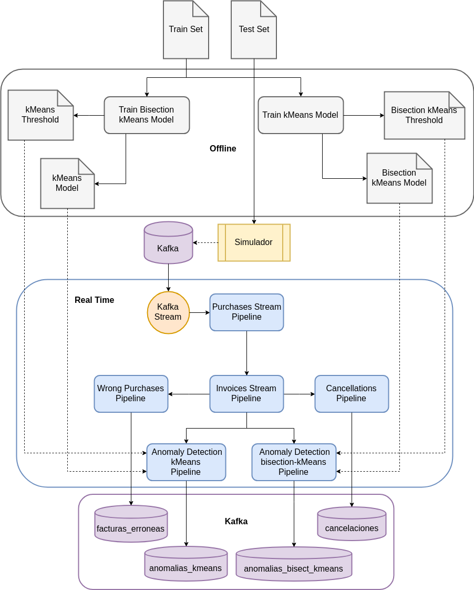

# Streaming Retail Analysis

This repo helps as introduction into data streaming processing. Inside, you will find out how to perform streaming using *Apache Trident* (Java) and *Apache Spark* (Scala API).

Both projects take a data input with invoice data (both purchases and cancellations). Data is sent to a *Kafka* topic by a simulator, which reads a csv file line by line. Each line represents a product purchase or cancellation within an invoice.

## Apache Spark

It is located inside the `spark_streaming/` folder. The setup and run instructions are in another readme file on that folder.

## Apache Storm Trident

It is located inside the `kafka_trident/` folder. The setup and run instructions are in another readme file on that folder.

